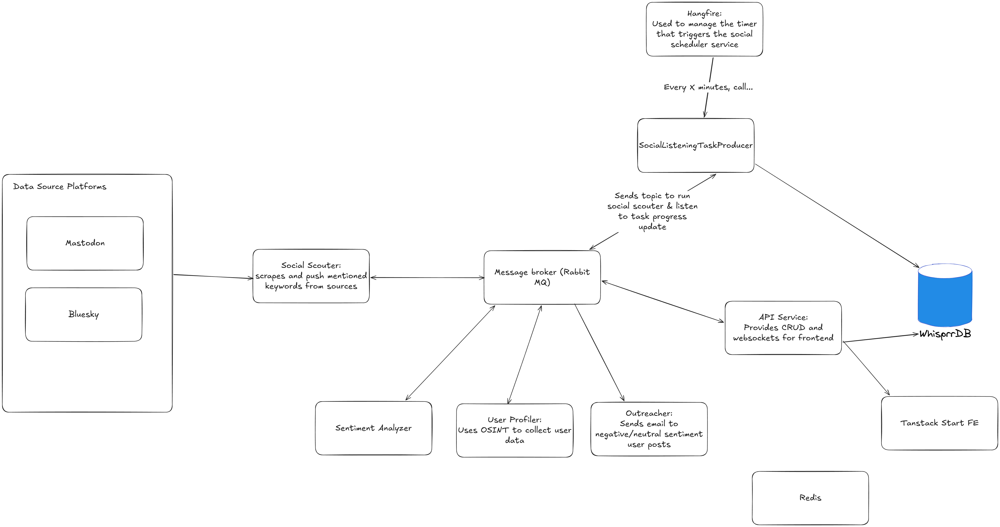

# Whisprr Distributed Monolith

## Insights and moving to a new iteration

When creating this project, my goal was to learn how I could implement microservices
in .NET. So far, **I SUPER LOVE IT!** .NET is so friendly in setting up projects
with a monorepo style which I like.

But as I do this version more, I'm starting to realize its becomming more of a
distributed monolith instead of microservice due to:
- I'm sharing domain models through the Entities library
- I'm sharing the same database instance to other services so those services can access the same instance

Here is the diagram:

As you can see, it clearly shows how WhisprrDb is used by other services.

So from this, I'm making a new version in [another repository](https://github.com/ElysMaldov/Whisprr) with these insights:
- Embrace data denormalization
- Seperate domain models (bounded context) and share contracts using Message Broker
- Utilize producer/consumer pattern to make my program run in realtime